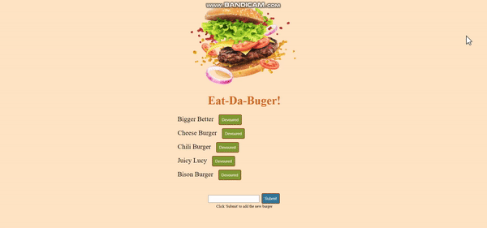

# DanielYu-HomeWork-13-Node-Express-Handlebars

* Use JaswDB MySQL to connected the database to the Heroku

[](https://opensource.org/licenses/MIT)


### Project Description

* A sample full-stack application that user can add their favorite burger, then devour or make them
* The application builds on MySQL as the model, express.js as the controller, and Handlebars as view

### Usage
1. Add new burger


2. Devour !



3. Make the burger


### Language
```md
Javascrpit
Node.js
Express-Handlebars
MySQL
JawsDB MySQL
```

## About
* Heroku link: https://homework-13-node-exphbs.herokuapp.com/
* Project Github: https://github.com/DanielYu0864/DanielYu-HomeWork-13-Node-Express-Handlebars
* Author: [`DanielYu0864`](https://github.com/DanielYu0864)

## Questions
*  For more question please contact me: adam741963@gmail.com


- - -
© 2020 - UW Coding Bootcamp Homework 13 Node Express Handlebars by Daniel Yu
